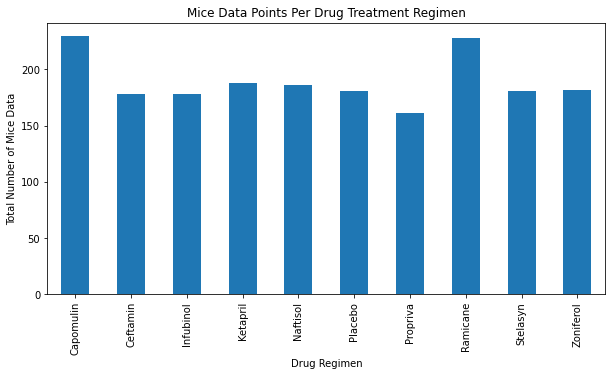
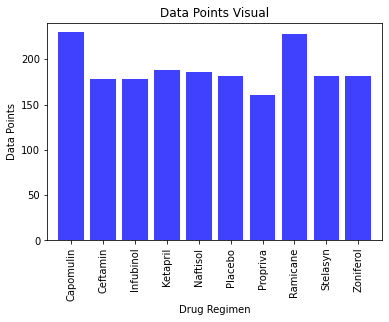
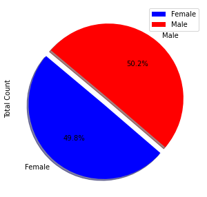
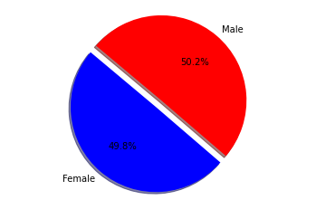
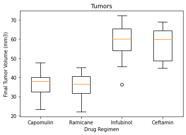
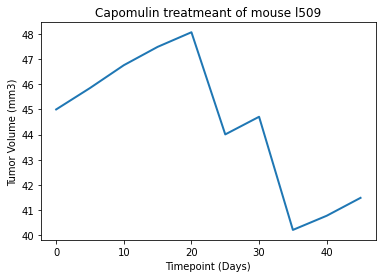
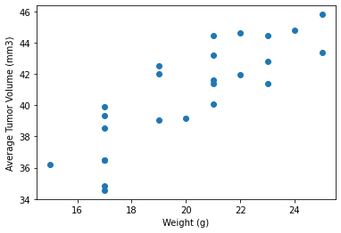
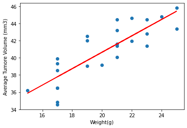

## Observations and Insights 


```python
print("1. There is a positive correlation between average tumor volume and weight within the subject mice.")
print("2. Capomulin and Ramicane had the most data points out of all the drugs present in the study.")
print("3. Capomulin and Ramicane were the most successful drugs in reducing the size of the tumors within the mice subjects.")
      
```


```python
# Dependencies and Setup
import matplotlib.pyplot as plt
import pandas as pd
import scipy.stats as st
import numpy as np

# Study data files
mouse_metadata_path = "data/Mouse_metadata.csv"
study_results_path = "data/Study_results.csv"

# Read the mouse data and the study results
mouse_metadata = pd.read_csv(mouse_metadata_path)
study_results = pd.read_csv(study_results_path)

# Combine the data into a single dataset
combined_df = pd.merge(mouse_metadata, study_results, how='outer')

# Display the data table for preview
combined_df.head()
```


<div>
<style scoped>
    .dataframe tbody tr th:only-of-type {
        vertical-align: middle;
    }

    .dataframe tbody tr th {
        vertical-align: top;
    }

    .dataframe thead th {
        text-align: right;
    }
</style>
<table border="1" class="dataframe">
  <thead>
    <tr style="text-align: right;">
      <th></th>
      <th>Mouse ID</th>
      <th>Drug Regimen</th>
      <th>Sex</th>
      <th>Age_months</th>
      <th>Weight (g)</th>
      <th>Timepoint</th>
      <th>Tumor Volume (mm3)</th>
      <th>Metastatic Sites</th>
    </tr>
  </thead>
  <tbody>
    <tr>
      <th>0</th>
      <td>k403</td>
      <td>Ramicane</td>
      <td>Male</td>
      <td>21</td>
      <td>16</td>
      <td>0</td>
      <td>45.000000</td>
      <td>0</td>
    </tr>
    <tr>
      <th>1</th>
      <td>k403</td>
      <td>Ramicane</td>
      <td>Male</td>
      <td>21</td>
      <td>16</td>
      <td>5</td>
      <td>38.825898</td>
      <td>0</td>
    </tr>
    <tr>
      <th>2</th>
      <td>k403</td>
      <td>Ramicane</td>
      <td>Male</td>
      <td>21</td>
      <td>16</td>
      <td>10</td>
      <td>35.014271</td>
      <td>1</td>
    </tr>
    <tr>
      <th>3</th>
      <td>k403</td>
      <td>Ramicane</td>
      <td>Male</td>
      <td>21</td>
      <td>16</td>
      <td>15</td>
      <td>34.223992</td>
      <td>1</td>
    </tr>
    <tr>
      <th>4</th>
      <td>k403</td>
      <td>Ramicane</td>
      <td>Male</td>
      <td>21</td>
      <td>16</td>
      <td>20</td>
      <td>32.997729</td>
      <td>1</td>
    </tr>
  </tbody>
</table>
</div>


```python
# Checking the number of mice.
combined_df.count()
```


    Mouse ID              1893
    Drug Regimen          1893
    Sex                   1893
    Age_months            1893
    Weight (g)            1893
    Timepoint             1893
    Tumor Volume (mm3)    1893
    Metastatic Sites      1893
    dtype: int64


```python
# Getting the duplicate mice by ID number that shows up for Mouse ID and Timepoint. 
mouse_data = combined_df["Mouse ID"].value_counts()
print(mouse_data)
timepoint_data = combined_df['Timepoint'].value_counts()
print(timepoint_data)
```

    g989    13
    z969    10
    l897    10
    l725    10
    b742    10
            ..
    x226     1
    l872     1
    h428     1
    t573     1
    n482     1
    Name: Mouse ID, Length: 249, dtype: int64
    0     250
    5     238
    10    223
    15    207
    20    195
    25    183
    30    171
    35    154
    40    142
    45    130
    Name: Timepoint, dtype: int64


## Summary Statistics


```python
# Generate a summary statistics table of mean, median, variance, standard deviation, and SEM of the tumor volume for each regimen

# Use groupby and summary statistical methods to calculate the following properties of each drug regimen: 
# mean, median, variance, standard deviation, and SEM of the tumor volume. 
# Assemble the resulting series into a single summary dataframe.

Mean = combined_df.groupby('Drug Regimen').mean()['Tumor Volume (mm3)']
Median = combined_df.groupby('Drug Regimen').median()['Tumor Volume (mm3)']
Variance = combined_df.groupby('Drug Regimen').var()['Tumor Volume (mm3)']
Standard = combined_df.groupby('Drug Regimen').std()['Tumor Volume (mm3)']
Sem = combined_df.groupby('Drug Regimen').sem()['Tumor Volume (mm3)']

new_df = pd.DataFrame(Mean)
stats = new_df.rename(columns={"Tumor Volume (mm3)": "Mean"})

stats["Median"] = Median
stats["Variance"] = Variance
stats["STD"] = Standard
stats["SEM"] = Sem

stats
```


<div>
<style scoped>
    .dataframe tbody tr th:only-of-type {
        vertical-align: middle;
    }

    .dataframe tbody tr th {
        vertical-align: top;
    }

    .dataframe thead th {
        text-align: right;
    }
</style>
<table border="1" class="dataframe">
  <thead>
    <tr style="text-align: right;">
      <th></th>
      <th>Mean</th>
      <th>Median</th>
      <th>Variance</th>
      <th>STD</th>
      <th>SEM</th>
    </tr>
    <tr>
      <th>Drug Regimen</th>
      <th></th>
      <th></th>
      <th></th>
      <th></th>
      <th></th>
    </tr>
  </thead>
  <tbody>
    <tr>
      <th>Capomulin</th>
      <td>40.675741</td>
      <td>41.557809</td>
      <td>24.947764</td>
      <td>4.994774</td>
      <td>0.329346</td>
    </tr>
    <tr>
      <th>Ceftamin</th>
      <td>52.591172</td>
      <td>51.776157</td>
      <td>39.290177</td>
      <td>6.268188</td>
      <td>0.469821</td>
    </tr>
    <tr>
      <th>Infubinol</th>
      <td>52.884795</td>
      <td>51.820584</td>
      <td>43.128684</td>
      <td>6.567243</td>
      <td>0.492236</td>
    </tr>
    <tr>
      <th>Ketapril</th>
      <td>55.235638</td>
      <td>53.698743</td>
      <td>68.553577</td>
      <td>8.279709</td>
      <td>0.603860</td>
    </tr>
    <tr>
      <th>Naftisol</th>
      <td>54.331565</td>
      <td>52.509285</td>
      <td>66.173479</td>
      <td>8.134708</td>
      <td>0.596466</td>
    </tr>
    <tr>
      <th>Placebo</th>
      <td>54.033581</td>
      <td>52.288934</td>
      <td>61.168083</td>
      <td>7.821003</td>
      <td>0.581331</td>
    </tr>
    <tr>
      <th>Propriva</th>
      <td>52.322552</td>
      <td>50.854632</td>
      <td>42.351070</td>
      <td>6.507770</td>
      <td>0.512884</td>
    </tr>
    <tr>
      <th>Ramicane</th>
      <td>40.216745</td>
      <td>40.673236</td>
      <td>23.486704</td>
      <td>4.846308</td>
      <td>0.320955</td>
    </tr>
    <tr>
      <th>Stelasyn</th>
      <td>54.233149</td>
      <td>52.431737</td>
      <td>59.450562</td>
      <td>7.710419</td>
      <td>0.573111</td>
    </tr>
    <tr>
      <th>Zoniferol</th>
      <td>53.236507</td>
      <td>51.818479</td>
      <td>48.533355</td>
      <td>6.966589</td>
      <td>0.516398</td>
    </tr>
  </tbody>
</table>
</div>


```python
# Generate a summary statistics table of mean, median, variance, standard deviation, and SEM of the tumor volume for each regimen
# Using the aggregation method, produce the same summary statistics in a single line

reg2_group = combined_df.groupby('Drug Regimen')
stats2 = reg2_group.agg(['mean','median','var','std','sem'])["Tumor Volume (mm3)"]
stats2
```


<div>
<style scoped>
    .dataframe tbody tr th:only-of-type {
        vertical-align: middle;
    }

    .dataframe tbody tr th {
        vertical-align: top;
    }

    .dataframe thead th {
        text-align: right;
    }
</style>
<table border="1" class="dataframe">
  <thead>
    <tr style="text-align: right;">
      <th></th>
      <th>mean</th>
      <th>median</th>
      <th>var</th>
      <th>std</th>
      <th>sem</th>
    </tr>
    <tr>
      <th>Drug Regimen</th>
      <th></th>
      <th></th>
      <th></th>
      <th></th>
      <th></th>
    </tr>
  </thead>
  <tbody>
    <tr>
      <th>Capomulin</th>
      <td>40.675741</td>
      <td>41.557809</td>
      <td>24.947764</td>
      <td>4.994774</td>
      <td>0.329346</td>
    </tr>
    <tr>
      <th>Ceftamin</th>
      <td>52.591172</td>
      <td>51.776157</td>
      <td>39.290177</td>
      <td>6.268188</td>
      <td>0.469821</td>
    </tr>
    <tr>
      <th>Infubinol</th>
      <td>52.884795</td>
      <td>51.820584</td>
      <td>43.128684</td>
      <td>6.567243</td>
      <td>0.492236</td>
    </tr>
    <tr>
      <th>Ketapril</th>
      <td>55.235638</td>
      <td>53.698743</td>
      <td>68.553577</td>
      <td>8.279709</td>
      <td>0.603860</td>
    </tr>
    <tr>
      <th>Naftisol</th>
      <td>54.331565</td>
      <td>52.509285</td>
      <td>66.173479</td>
      <td>8.134708</td>
      <td>0.596466</td>
    </tr>
    <tr>
      <th>Placebo</th>
      <td>54.033581</td>
      <td>52.288934</td>
      <td>61.168083</td>
      <td>7.821003</td>
      <td>0.581331</td>
    </tr>
    <tr>
      <th>Propriva</th>
      <td>52.322552</td>
      <td>50.854632</td>
      <td>42.351070</td>
      <td>6.507770</td>
      <td>0.512884</td>
    </tr>
    <tr>
      <th>Ramicane</th>
      <td>40.216745</td>
      <td>40.673236</td>
      <td>23.486704</td>
      <td>4.846308</td>
      <td>0.320955</td>
    </tr>
    <tr>
      <th>Stelasyn</th>
      <td>54.233149</td>
      <td>52.431737</td>
      <td>59.450562</td>
      <td>7.710419</td>
      <td>0.573111</td>
    </tr>
    <tr>
      <th>Zoniferol</th>
      <td>53.236507</td>
      <td>51.818479</td>
      <td>48.533355</td>
      <td>6.966589</td>
      <td>0.516398</td>
    </tr>
  </tbody>
</table>
</div>


## Bar and Pie Charts


```python
#Find unique number of mice for each drug regimen using Group By
regimen_df = combined_df.groupby(["Drug Regimen"]).count()["Mouse ID"]
regimen_df

```


    Drug Regimen
    Capomulin    230
    Ceftamin     178
    Infubinol    178
    Ketapril     188
    Naftisol     186
    Placebo      181
    Propriva     161
    Ramicane     228
    Stelasyn     181
    Zoniferol    182
    Name: Mouse ID, dtype: int64


```python
# Generate a bar plot showing the total number of unique mice tested on each drug regimen using pandas.

regimen_df.plot(kind="bar", figsize=(10,5))

#set chart title
plt.title("Mice Data Points Per Drug Treatment Regimen")
plt.xlabel("Drug Regimen")
plt.ylabel("Total Number of Mice Data")

#show chart and set layout
plt.show()
plt.tight_layout()
```





    <Figure size 432x288 with 0 Axes>


```python
# Generate a bar plot showing the total number of unique mice tested on each drug regimen using pyplot.

users = [230, 178, 178, 188, 186, 181, 161, 228, 181, 182]

#Set the x_axis to be the amount of the Data Regimen
x_axis = np.arange(len(regimen_df))

plt.bar(x_axis, users, color='b', alpha=0.75, align='center')

tick_locations = [value for value in x_axis]
plt.xticks(tick_locations, ['Capomulin', 'Ceftamin', 'Infubinol', 'Ketapril', 'Naftisol', 'Placebo', 'Propriva', 'Ramicane', 'Stelasyn', 'Zoniferol'],  rotation='vertical')

plt.xlim(-0.75, len(x_axis)-0.25)

plt.ylim(0, max(users)+10)

plt.title("Data Points Visual")
plt.xlabel("Drug Regimen")
plt.ylabel("Data Points")
```


    Text(0, 0.5, 'Data Points')





```python
#Find unique number of male vs female using Group By
gender_df = combined_df.groupby(["Mouse ID","Sex"])
gender_df

mouse_gender_df = pd.DataFrame(gender_df.size())

#Create Dataframe
mouse_gender = pd.DataFrame(mouse_gender_df.groupby(["Sex"]).count())
mouse_gender.columns = ["Total Count"]

#Percentage of Male vs Female
mouse_gender["Percentage of Sex"] = (100*(mouse_gender["Total Count"]/mouse_gender["Total Count"].sum()))

mouse_gender
```


<div>
<style scoped>
    .dataframe tbody tr th:only-of-type {
        vertical-align: middle;
    }

    .dataframe tbody tr th {
        vertical-align: top;
    }

    .dataframe thead th {
        text-align: right;
    }
</style>
<table border="1" class="dataframe">
  <thead>
    <tr style="text-align: right;">
      <th></th>
      <th>Total Count</th>
      <th>Percentage of Sex</th>
    </tr>
    <tr>
      <th>Sex</th>
      <th></th>
      <th></th>
    </tr>
  </thead>
  <tbody>
    <tr>
      <th>Female</th>
      <td>124</td>
      <td>49.799197</td>
    </tr>
    <tr>
      <th>Male</th>
      <td>125</td>
      <td>50.200803</td>
    </tr>
  </tbody>
</table>
</div>


```python
# Generate a pie plot showing the distribution of female versus male mice using pandas
colors = ['blue', 'red']
explode = (0.1, 0)
plot = mouse_gender.plot.pie(y='Total Count',figsize=(5,5), colors = colors, startangle=140, explode = explode, shadow = True, autopct="%1.1f%%")
```





```python
# Generate a pie plot showing the distribution of female versus male mice using pyplot

labels = ["Female","Male"]
sizes = [49.799197,50.200803]
colors = ['blue', 'red']
explode = (0.1, 0)

plt.pie(sizes, explode=explode, labels=labels, colors=colors, autopct="%1.1f%%", shadow=True, startangle=140)

plt.axis("equal")

```


    (-1.1879383453817904,
     1.111754351424799,
     -1.1987553745848882,
     1.1126035084692154)





## Quartiles, Outliers and Boxplots


```python
cap_df = combined_df.loc[combined_df["Drug Regimen"] == "Capomulin",:]
ram_df = combined_df.loc[combined_df["Drug Regimen"] == "Ramicane", :]
inf_df = combined_df.loc[combined_df["Drug Regimen"] == "Infubinol", :]
ceft_df = combined_df.loc[combined_df["Drug Regimen"] == "Ceftamin", :]
```


```python
#Capomulin
cap_df.head()
```


<div>
<style scoped>
    .dataframe tbody tr th:only-of-type {
        vertical-align: middle;
    }

    .dataframe tbody tr th {
        vertical-align: top;
    }

    .dataframe thead th {
        text-align: right;
    }
</style>
<table border="1" class="dataframe">
  <thead>
    <tr style="text-align: right;">
      <th></th>
      <th>Mouse ID</th>
      <th>Drug Regimen</th>
      <th>Sex</th>
      <th>Age_months</th>
      <th>Weight (g)</th>
      <th>Timepoint</th>
      <th>Tumor Volume (mm3)</th>
      <th>Metastatic Sites</th>
    </tr>
  </thead>
  <tbody>
    <tr>
      <th>10</th>
      <td>s185</td>
      <td>Capomulin</td>
      <td>Female</td>
      <td>3</td>
      <td>17</td>
      <td>0</td>
      <td>45.000000</td>
      <td>0</td>
    </tr>
    <tr>
      <th>11</th>
      <td>s185</td>
      <td>Capomulin</td>
      <td>Female</td>
      <td>3</td>
      <td>17</td>
      <td>5</td>
      <td>43.878496</td>
      <td>0</td>
    </tr>
    <tr>
      <th>12</th>
      <td>s185</td>
      <td>Capomulin</td>
      <td>Female</td>
      <td>3</td>
      <td>17</td>
      <td>10</td>
      <td>37.614948</td>
      <td>0</td>
    </tr>
    <tr>
      <th>13</th>
      <td>s185</td>
      <td>Capomulin</td>
      <td>Female</td>
      <td>3</td>
      <td>17</td>
      <td>15</td>
      <td>38.177232</td>
      <td>0</td>
    </tr>
    <tr>
      <th>14</th>
      <td>s185</td>
      <td>Capomulin</td>
      <td>Female</td>
      <td>3</td>
      <td>17</td>
      <td>20</td>
      <td>36.866876</td>
      <td>0</td>
    </tr>
  </tbody>
</table>
</div>


```python
#Capomulin Tumor Volume at Greatest Timepoint
caplast = cap_df.groupby('Mouse ID').max()['Timepoint']
caplastvol = pd.DataFrame(caplast)
caplastmerge = pd.merge(caplastvol, combined_df, on=("Mouse ID","Timepoint"),how="left")
caplastmerge.head(5)
```


<div>
<style scoped>
    .dataframe tbody tr th:only-of-type {
        vertical-align: middle;
    }

    .dataframe tbody tr th {
        vertical-align: top;
    }

    .dataframe thead th {
        text-align: right;
    }
</style>
<table border="1" class="dataframe">
  <thead>
    <tr style="text-align: right;">
      <th></th>
      <th>Mouse ID</th>
      <th>Timepoint</th>
      <th>Drug Regimen</th>
      <th>Sex</th>
      <th>Age_months</th>
      <th>Weight (g)</th>
      <th>Tumor Volume (mm3)</th>
      <th>Metastatic Sites</th>
    </tr>
  </thead>
  <tbody>
    <tr>
      <th>0</th>
      <td>b128</td>
      <td>45</td>
      <td>Capomulin</td>
      <td>Female</td>
      <td>9</td>
      <td>22</td>
      <td>38.982878</td>
      <td>2</td>
    </tr>
    <tr>
      <th>1</th>
      <td>b742</td>
      <td>45</td>
      <td>Capomulin</td>
      <td>Male</td>
      <td>7</td>
      <td>21</td>
      <td>38.939633</td>
      <td>0</td>
    </tr>
    <tr>
      <th>2</th>
      <td>f966</td>
      <td>20</td>
      <td>Capomulin</td>
      <td>Male</td>
      <td>16</td>
      <td>17</td>
      <td>30.485985</td>
      <td>0</td>
    </tr>
    <tr>
      <th>3</th>
      <td>g288</td>
      <td>45</td>
      <td>Capomulin</td>
      <td>Male</td>
      <td>3</td>
      <td>19</td>
      <td>37.074024</td>
      <td>1</td>
    </tr>
    <tr>
      <th>4</th>
      <td>g316</td>
      <td>45</td>
      <td>Capomulin</td>
      <td>Female</td>
      <td>22</td>
      <td>22</td>
      <td>40.159220</td>
      <td>2</td>
    </tr>
  </tbody>
</table>
</div>


```python
tumors = caplastmerge["Tumor Volume (mm3)"]

quartiles = tumors.quantile([.25,.5,.75])
lowerq = quartiles[0.25]
upperq = quartiles[0.75]
iqr = upperq-lowerq

lower_bound = lowerq - (1.5*iqr)
upper_bound = upperq + (1.5*iqr)
print(f"Capomulin potential outliers could be values below {lower_bound} and above {upper_bound} could be outliers.")
```

    Capomulin potential outliers could be values below 20.70456164999999 and above 51.83201549 could be outliers.


```python
#Ramicane Tumor Volume at Greatest Timepoint
ramlast = ram_df.groupby('Mouse ID').max()['Timepoint']
ramlastvol = pd.DataFrame(ramlast)
ramlastmerge = pd.merge(ramlastvol, combined_df, on=("Mouse ID","Timepoint"),how="left")
ramlastmerge.head(10)
```


<div>
<style scoped>
    .dataframe tbody tr th:only-of-type {
        vertical-align: middle;
    }

    .dataframe tbody tr th {
        vertical-align: top;
    }

    .dataframe thead th {
        text-align: right;
    }
</style>
<table border="1" class="dataframe">
  <thead>
    <tr style="text-align: right;">
      <th></th>
      <th>Mouse ID</th>
      <th>Timepoint</th>
      <th>Drug Regimen</th>
      <th>Sex</th>
      <th>Age_months</th>
      <th>Weight (g)</th>
      <th>Tumor Volume (mm3)</th>
      <th>Metastatic Sites</th>
    </tr>
  </thead>
  <tbody>
    <tr>
      <th>0</th>
      <td>a411</td>
      <td>45</td>
      <td>Ramicane</td>
      <td>Male</td>
      <td>3</td>
      <td>22</td>
      <td>38.407618</td>
      <td>1</td>
    </tr>
    <tr>
      <th>1</th>
      <td>a444</td>
      <td>45</td>
      <td>Ramicane</td>
      <td>Female</td>
      <td>10</td>
      <td>25</td>
      <td>43.047543</td>
      <td>0</td>
    </tr>
    <tr>
      <th>2</th>
      <td>a520</td>
      <td>45</td>
      <td>Ramicane</td>
      <td>Male</td>
      <td>13</td>
      <td>21</td>
      <td>38.810366</td>
      <td>1</td>
    </tr>
    <tr>
      <th>3</th>
      <td>a644</td>
      <td>45</td>
      <td>Ramicane</td>
      <td>Female</td>
      <td>7</td>
      <td>17</td>
      <td>32.978522</td>
      <td>1</td>
    </tr>
    <tr>
      <th>4</th>
      <td>c458</td>
      <td>30</td>
      <td>Ramicane</td>
      <td>Female</td>
      <td>23</td>
      <td>20</td>
      <td>38.342008</td>
      <td>2</td>
    </tr>
    <tr>
      <th>5</th>
      <td>c758</td>
      <td>45</td>
      <td>Ramicane</td>
      <td>Male</td>
      <td>9</td>
      <td>17</td>
      <td>33.397653</td>
      <td>1</td>
    </tr>
    <tr>
      <th>6</th>
      <td>d251</td>
      <td>45</td>
      <td>Ramicane</td>
      <td>Female</td>
      <td>8</td>
      <td>19</td>
      <td>37.311236</td>
      <td>2</td>
    </tr>
    <tr>
      <th>7</th>
      <td>e662</td>
      <td>45</td>
      <td>Ramicane</td>
      <td>Male</td>
      <td>8</td>
      <td>24</td>
      <td>40.659006</td>
      <td>2</td>
    </tr>
    <tr>
      <th>8</th>
      <td>g791</td>
      <td>45</td>
      <td>Ramicane</td>
      <td>Male</td>
      <td>11</td>
      <td>16</td>
      <td>29.128472</td>
      <td>1</td>
    </tr>
    <tr>
      <th>9</th>
      <td>i177</td>
      <td>45</td>
      <td>Ramicane</td>
      <td>Male</td>
      <td>10</td>
      <td>18</td>
      <td>33.562402</td>
      <td>3</td>
    </tr>
  </tbody>
</table>
</div>


```python
tumors2 = ramlastmerge["Tumor Volume (mm3)"]

quartiles2 = tumors2.quantile([.25,.5,.75])
lowerq2 = quartiles2[0.25]
upperq2 = quartiles2[0.75]
iqr2 = upperq2-lowerq2

lower_bound2 = lowerq2 - (1.5*iqr2)
upper_bound2 = upperq2 + (1.5*iqr2)
print(f"Ramicane potential outliers could be values below {lower_bound2} and above {upper_bound2} could be outliers.")
```

    Ramicane potential outliers could be values below 17.912664470000003 and above 54.30681135 could be outliers.


```python
#Infubinol Tumor Volume at Greatest Timepoint
inflast = inf_df.groupby('Mouse ID').max()['Timepoint']
inflastvol = pd.DataFrame(inflast)
inflastmerge = pd.merge(inflastvol, combined_df, on=("Mouse ID","Timepoint"),how="left")
inflastmerge.head(10)
```


<div>
<style scoped>
    .dataframe tbody tr th:only-of-type {
        vertical-align: middle;
    }

    .dataframe tbody tr th {
        vertical-align: top;
    }

    .dataframe thead th {
        text-align: right;
    }
</style>
<table border="1" class="dataframe">
  <thead>
    <tr style="text-align: right;">
      <th></th>
      <th>Mouse ID</th>
      <th>Timepoint</th>
      <th>Drug Regimen</th>
      <th>Sex</th>
      <th>Age_months</th>
      <th>Weight (g)</th>
      <th>Tumor Volume (mm3)</th>
      <th>Metastatic Sites</th>
    </tr>
  </thead>
  <tbody>
    <tr>
      <th>0</th>
      <td>a203</td>
      <td>45</td>
      <td>Infubinol</td>
      <td>Female</td>
      <td>20</td>
      <td>23</td>
      <td>67.973419</td>
      <td>2</td>
    </tr>
    <tr>
      <th>1</th>
      <td>a251</td>
      <td>45</td>
      <td>Infubinol</td>
      <td>Female</td>
      <td>21</td>
      <td>25</td>
      <td>65.525743</td>
      <td>1</td>
    </tr>
    <tr>
      <th>2</th>
      <td>a577</td>
      <td>30</td>
      <td>Infubinol</td>
      <td>Female</td>
      <td>6</td>
      <td>25</td>
      <td>57.031862</td>
      <td>2</td>
    </tr>
    <tr>
      <th>3</th>
      <td>a685</td>
      <td>45</td>
      <td>Infubinol</td>
      <td>Male</td>
      <td>8</td>
      <td>30</td>
      <td>66.083066</td>
      <td>3</td>
    </tr>
    <tr>
      <th>4</th>
      <td>c139</td>
      <td>45</td>
      <td>Infubinol</td>
      <td>Male</td>
      <td>11</td>
      <td>28</td>
      <td>72.226731</td>
      <td>2</td>
    </tr>
    <tr>
      <th>5</th>
      <td>c326</td>
      <td>5</td>
      <td>Infubinol</td>
      <td>Female</td>
      <td>18</td>
      <td>25</td>
      <td>36.321346</td>
      <td>0</td>
    </tr>
    <tr>
      <th>6</th>
      <td>c895</td>
      <td>30</td>
      <td>Infubinol</td>
      <td>Female</td>
      <td>7</td>
      <td>29</td>
      <td>60.969711</td>
      <td>2</td>
    </tr>
    <tr>
      <th>7</th>
      <td>e476</td>
      <td>45</td>
      <td>Infubinol</td>
      <td>Male</td>
      <td>23</td>
      <td>26</td>
      <td>62.435404</td>
      <td>1</td>
    </tr>
    <tr>
      <th>8</th>
      <td>f345</td>
      <td>45</td>
      <td>Infubinol</td>
      <td>Male</td>
      <td>23</td>
      <td>26</td>
      <td>60.918767</td>
      <td>1</td>
    </tr>
    <tr>
      <th>9</th>
      <td>i386</td>
      <td>40</td>
      <td>Infubinol</td>
      <td>Female</td>
      <td>23</td>
      <td>29</td>
      <td>67.289621</td>
      <td>4</td>
    </tr>
  </tbody>
</table>
</div>


```python
tumors3 = inflastmerge["Tumor Volume (mm3)"]

quartiles3 = tumors3.quantile([.25,.5,.75])
lowerq3 = quartiles3[0.25]
upperq3 = quartiles3[0.75]
iqr3 = upperq3-lowerq3

lower_bound3 = lowerq3 - (1.5*iqr3)
upper_bound3 = upperq3 + (1.5*iqr3)
print(f"Infubinol potential outliers could be values below {lower_bound3} and above {upper_bound3} could be outliers.")
```

    Infubinol potential outliers could be values below 36.83290494999999 and above 82.74144559000001 could be outliers.


```python
#Ceftamin Tumor Volume at Greatest Timepoint
ceftlast = ceft_df.groupby('Mouse ID').max()['Timepoint']
ceftlastvol = pd.DataFrame(ceftlast)
ceftlastmerge = pd.merge(ceftlastvol, combined_df, on=("Mouse ID","Timepoint"),how="left")
ceftlastmerge.head(10)
```


<div>
<style scoped>
    .dataframe tbody tr th:only-of-type {
        vertical-align: middle;
    }

    .dataframe tbody tr th {
        vertical-align: top;
    }

    .dataframe thead th {
        text-align: right;
    }
</style>
<table border="1" class="dataframe">
  <thead>
    <tr style="text-align: right;">
      <th></th>
      <th>Mouse ID</th>
      <th>Timepoint</th>
      <th>Drug Regimen</th>
      <th>Sex</th>
      <th>Age_months</th>
      <th>Weight (g)</th>
      <th>Tumor Volume (mm3)</th>
      <th>Metastatic Sites</th>
    </tr>
  </thead>
  <tbody>
    <tr>
      <th>0</th>
      <td>a275</td>
      <td>45</td>
      <td>Ceftamin</td>
      <td>Female</td>
      <td>20</td>
      <td>28</td>
      <td>62.999356</td>
      <td>3</td>
    </tr>
    <tr>
      <th>1</th>
      <td>b447</td>
      <td>0</td>
      <td>Ceftamin</td>
      <td>Male</td>
      <td>2</td>
      <td>30</td>
      <td>45.000000</td>
      <td>0</td>
    </tr>
    <tr>
      <th>2</th>
      <td>b487</td>
      <td>25</td>
      <td>Ceftamin</td>
      <td>Female</td>
      <td>6</td>
      <td>28</td>
      <td>56.057749</td>
      <td>1</td>
    </tr>
    <tr>
      <th>3</th>
      <td>b759</td>
      <td>30</td>
      <td>Ceftamin</td>
      <td>Female</td>
      <td>12</td>
      <td>25</td>
      <td>55.742829</td>
      <td>1</td>
    </tr>
    <tr>
      <th>4</th>
      <td>f436</td>
      <td>15</td>
      <td>Ceftamin</td>
      <td>Female</td>
      <td>3</td>
      <td>25</td>
      <td>48.722078</td>
      <td>2</td>
    </tr>
    <tr>
      <th>5</th>
      <td>h531</td>
      <td>5</td>
      <td>Ceftamin</td>
      <td>Male</td>
      <td>5</td>
      <td>27</td>
      <td>47.784682</td>
      <td>0</td>
    </tr>
    <tr>
      <th>6</th>
      <td>j296</td>
      <td>45</td>
      <td>Ceftamin</td>
      <td>Female</td>
      <td>24</td>
      <td>30</td>
      <td>61.849023</td>
      <td>3</td>
    </tr>
    <tr>
      <th>7</th>
      <td>k210</td>
      <td>45</td>
      <td>Ceftamin</td>
      <td>Male</td>
      <td>15</td>
      <td>28</td>
      <td>68.923185</td>
      <td>3</td>
    </tr>
    <tr>
      <th>8</th>
      <td>l471</td>
      <td>45</td>
      <td>Ceftamin</td>
      <td>Female</td>
      <td>7</td>
      <td>28</td>
      <td>67.748662</td>
      <td>1</td>
    </tr>
    <tr>
      <th>9</th>
      <td>l490</td>
      <td>30</td>
      <td>Ceftamin</td>
      <td>Male</td>
      <td>24</td>
      <td>26</td>
      <td>57.918381</td>
      <td>3</td>
    </tr>
  </tbody>
</table>
</div>


```python
tumors4 = ceftlastmerge["Tumor Volume (mm3)"]

quartiles4 = tumors4.quantile([.25,.5,.75])
lowerq4 = quartiles4[0.25]
upperq4 = quartiles4[0.75]
iqr4 = upperq4-lowerq4

lower_bound4 = lowerq4 - (1.5*iqr4)
upper_bound4 = upperq4 + (1.5*iqr4)
print(f"Ceftamin potential outliers could be values below {lower_bound4} and above {upper_bound4} could be outliers.")
```

    Ceftamin potential outliers could be values below 25.355449580000002 and above 87.66645829999999 could be outliers.


```python
# Generate a box plot of the final tumor volume of each mouse across four regimens of interest
data_to_plot = [tumors, tumors2, tumors3, tumors4]

fig1, ax1 = plt.subplots()
ax1.set_title('Tumors')
ax1.set_ylabel('Final Tumor Volume (mm3)')
ax1.set_xlabel('Drug Regimen')

ax1.boxplot(data_to_plot, labels=["Capomulin","Ramicane","Infubinol","Ceftamin",])

plt.savefig('boxplot')
plt.show()
```





## Line and Scatter Plots


```python
#Create dataframe for Mouse treated with Capomulin
capomulin_df = cap_df.loc[cap_df["Mouse ID"] == "l509",:]
capomulin_df.head()
```


<div>
<style scoped>
    .dataframe tbody tr th:only-of-type {
        vertical-align: middle;
    }

    .dataframe tbody tr th {
        vertical-align: top;
    }

    .dataframe thead th {
        text-align: right;
    }
</style>
<table border="1" class="dataframe">
  <thead>
    <tr style="text-align: right;">
      <th></th>
      <th>Mouse ID</th>
      <th>Drug Regimen</th>
      <th>Sex</th>
      <th>Age_months</th>
      <th>Weight (g)</th>
      <th>Timepoint</th>
      <th>Tumor Volume (mm3)</th>
      <th>Metastatic Sites</th>
    </tr>
  </thead>
  <tbody>
    <tr>
      <th>371</th>
      <td>l509</td>
      <td>Capomulin</td>
      <td>Male</td>
      <td>17</td>
      <td>21</td>
      <td>0</td>
      <td>45.000000</td>
      <td>0</td>
    </tr>
    <tr>
      <th>372</th>
      <td>l509</td>
      <td>Capomulin</td>
      <td>Male</td>
      <td>17</td>
      <td>21</td>
      <td>5</td>
      <td>45.851193</td>
      <td>0</td>
    </tr>
    <tr>
      <th>373</th>
      <td>l509</td>
      <td>Capomulin</td>
      <td>Male</td>
      <td>17</td>
      <td>21</td>
      <td>10</td>
      <td>46.759074</td>
      <td>0</td>
    </tr>
    <tr>
      <th>374</th>
      <td>l509</td>
      <td>Capomulin</td>
      <td>Male</td>
      <td>17</td>
      <td>21</td>
      <td>15</td>
      <td>47.488599</td>
      <td>1</td>
    </tr>
    <tr>
      <th>375</th>
      <td>l509</td>
      <td>Capomulin</td>
      <td>Male</td>
      <td>17</td>
      <td>21</td>
      <td>20</td>
      <td>48.070452</td>
      <td>2</td>
    </tr>
  </tbody>
</table>
</div>


```python
# Generate a line plot of tumor volume vs. time point for a mouse treated with Capomulin

x_axisTP = capomulin_df["Timepoint"]
tumsiz = capomulin_df["Tumor Volume (mm3)"]

plt.title('Capomulin treatmeant of mouse l509')
plt.plot(x_axisTP, tumsiz,linewidth=2, markersize=12)
plt.xlabel('Timepoint (Days)')
plt.ylabel('Tumor Volume (mm3)')

plt.savefig('linechart')
plt.show()
```





```python
# Generate a scatter plot of average tumor volume vs. mouse weight for the Capomulin regimen
capavg = cap_df.groupby(['Mouse ID']).mean()
plt.scatter(capavg['Weight (g)'],capavg['Tumor Volume (mm3)'])
plt.xlabel('Weight (g)')
plt.ylabel('Average Tumor Volume (mm3)')

plt.savefig('scatterplot')
plt.show()
```





## Correlation and Regression


```python
# Calculate the correlation coefficient and linear regression model 
# for mouse weight and average tumor volume for the Capomulin regimen

corr=round(st.pearsonr(capavg['Weight (g)'],capavg['Tumor Volume (mm3)'])[0],2)
print(f"The correlation between mouse weight and average tumor volume is {corr}")
```

    The correlation between mouse weight and average tumor volume is 0.84


```python

model=st.linregress(capavg['Weight (g)'],capavg['Tumor Volume (mm3)'])
model
```


    LinregressResult(slope=0.9544396890241045, intercept=21.552160532685015, rvalue=0.8419363424694718, pvalue=1.3225722434712642e-07, stderr=0.1275435903320134)


```python
mslope = 0.9544396890241045
bintercept = 21.552160532685015
```


```python
y_values = capavg['Weight (g)']*mslope+bintercept
plt.scatter(capavg['Weight (g)'],capavg['Tumor Volume (mm3)'])
plt.plot(capavg['Weight (g)'],y_values,color="red")
plt.xlabel('Weight(g)')
plt.ylabel('Average Tumore Volume (mm3)')

plt.savefig('linearregression')
plt.show()
```





```python

```
